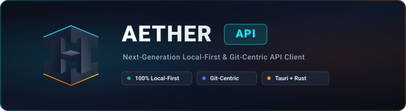

<div align="center">



<br/>
<br/>

**Your APIs. Your Files. Your Control.**  
_Aether API là API Client mã nguồn mở thế hệ mới: **Local-first**, **Git-centric**, bảo mật cao và siêu nhẹ dành cho lập trình viên._

<br/>

[](LICENSE)
[](https://v2.tauri.app/)
[](https://react.dev/)
[](https://www.rust-lang.org/)
[](#tuyên-ngôn-quyền-riêng-tư-privacy-manifesto)

</div>

---

## Giới thiệu (Overview)

**Aether API** sinh ra để giải quyết triệt để sự phụ thuộc vào cloud, tình trạng vendor lock-in, thu thập dữ liệu (telemetry) và tốc độ nặng nề của các công cụ API truyền thống.

Toàn bộ collections, folders, requests và environments của bạn được lưu dưới dạng **tệp tin YAML chuẩn trên ổ đĩa**, sẵn sàng đưa vào **Git** để phân nhánh (branch), đánh giá (PR review), và cộng tác cùng đồng đội mà không cần tài khoản hay server trung gian.

---

## Tính năng nổi bật (Key Features)

### 1. File-System & Git-Centric Workspaces

- Workspaces là các thư mục thông thường trên máy tính của bạn.
- Mọi thay đổi lưu trực tiếp thành các file `.yml` tinh gọn, sẵn sàng cho `git commit`, `git merge`, `git diff`.
- Tự động đồng bộ với hệ thống tệp tin (File System Watcher) theo thời gian thực.

### 2. Trải nghiệm gửi Request mạnh mẽ & Chuẩn xác

- **Đầy đủ HTTP Methods**: `GET`, `POST`, `PUT`, `DELETE`, `PATCH`, `HEAD`, `OPTIONS`.
- **Query Params & Custom Headers**: Trình biên tập bảng trực quan, bật/tắt từng dòng linh hoạt.
- **Authentication**: Hỗ trợ Bearer Token, Basic Auth, API Key (Header/Query).
- **Body Formats đa dạng**: `JSON` (kèm Monaco Editor & format tự động), `Text`, `XML`, `Form URL-Encoded`, `Multipart Form Data` (hỗ trợ file upload), và `Binary`.
- **Response Viewer chuyên sâu**:
  - Chế độ **Pretty** (Monaco Editor với theme tối ưu), **Raw**, **Preview**.
  - Bảng thống kê Headers, Request Timeline, Status Code, Latency (ms), và Dung lượng dữ liệu.
  - Tải response về máy (`Download Response`).

### 3. Biến môi trường thông minh & Placeholder Autocomplete

- Hỗ trợ cú pháp `{{variable_name}}` trên toàn bộ URL, Headers, Params, Auth và Request Body.
- **Tự động gợi ý (Autocomplete)** khi gõ `{{` với điều hướng bàn phím `↑` `↓` `Enter`.
- **Secret Masking**: Giá trị nhạy cảm (API Keys, Passwords, Tokens) được ẩn dạng `••••••••` kèm icon mắt bật/tắt và tooltip xem chi tiết nguồn biến (_Global_ vs _Environment_).
- **Mã hoá On-Device (AES-256-GCM)**: Secret variables được bảo vệ bằng passphrase master key với thuật toán mã hoá mạnh mẽ, không bao giờ lưu trữ plain text lên ổ đĩa.

### 4. Terminal nhúng đa Tab (Embedded Multi-Tab Terminal)

- Tích hợp terminal thật (PTY) ngay trong ứng dụng được phát triển bằng Rust và xterm.js.
- Hỗ trợ mở nhiều tab terminal độc lập, chạy trực tiếp `git`, `curl`, `npm`, `cargo` ngay tại thư mục workspace.

### 5. Tự động sinh mã nguồn (Code Snippets Generator)

- Chuyển đổi mọi HTTP request thành mã nguồn chỉ với 1 click:
  - **cURL**, **HTTPie**, **Wget**
  - **JavaScript / TypeScript (Fetch API)**
  - **Python (Requests)**
  - **Rust (Reqwest)**
  - **Go (net/http)**
  - **Java (OkHttp)**

### 6. Phím tắt & Công cụ điều hướng cấp tốc (Power Tools)

- **Search Open Tabs (`Ctrl+Shift+A`)**: Tìm kiếm và chuyển tab đang mở siêu tốc với bộ lọc method và cảnh báo unsaved dirty dot `●`.
- **Quick Open (`Ctrl+P`)**: Tìm kiếm mở nhanh file request / folder trong explorer.
- **Command Palette (`Ctrl+K` / `Ctrl+Shift+P`)**: Danh mục toàn bộ hành động nhanh.
- **Lăn chuột cuộn Tab (Mouse Wheel)**: Rê chuột vào thanh tab bar và lăn con lăn để trượt danh sách tab sang trái/phải mượt mà.

---

## Tuyên ngôn Quyền riêng tư (Privacy Manifesto)

- **100% Local-First & Zero Telemetry**: Aether API không thu thập, không theo dõi, không gửi bất kỳ request headers, payloads hay responses nào về server bên ngoài.
- **Bảo mật tuyệt đối**: Dữ liệu và bí mật của bạn chỉ nằm trên máy tính của bạn.
- **Không Vendor Lock-in**: Toàn quyền sao lưu, đồng bộ qua Git, Google Drive, Dropbox hoặc bất kỳ nền tảng nào bạn chọn.

---

## Công nghệ sử dụng (Tech Stack)

| Thành phần                      | Công nghệ                                                                                                    |
| :------------------------------ | :----------------------------------------------------------------------------------------------------------- |
| **Core Shell & Native Backend** | [Tauri v2](https://v2.tauri.app/) (Rust 2021)                                                                |
| **HTTP Engine**                 | [Reqwest](https://github.com/seanmonstar/reqwest) + [Tokio](https://tokio.rs/)                               |
| **Frontend Framework**          | [React 19](https://react.dev/) + [TypeScript](https://www.typescriptlang.org/) + [Vite](https://vitejs.dev/) |
| **UI Components & Icons**       | [Mantine v7](https://mantine.dev/) + [Tabler Icons](https://tabler.io/icons)                                 |
| **Code Editor**                 | [Monaco Editor](https://microsoft.github.io/monaco-editor/)                                                  |
| **Terminal**                    | [xterm.js](https://xtermjs.org/) + Portable PTY                                                              |
| **Mã hoá (Cryptography)**       | AES-256-GCM + PBKDF2 (Rust `aes-gcm` crate)                                                                  |

---

## Hướng dẫn Cài đặt & Chạy Development (Getting Started)

### Yêu cầu hệ thống (Prerequisites)

1. **Node.js**: Phiên bản 18.x trở lên.
2. **pnpm**: Trình quản lý package (`npm install -g pnpm`).
3. **Rust Toolchain**: Đã cài đặt `cargo` và `rustc` ([rustup.rs](https://rustup.rs/)).
4. **Cài đặt thư viện hệ thống cần thiết cho Tauri (Linux)**:

   ```bash
   # Debian/Ubuntu
   sudo apt update && sudo apt install -y libwebkit2gtk-4.1-dev build-essential curl wget file libxdo-dev libssl-dev libayatana-appindicator3-dev librsvg2-dev
   ```

### Các bước khởi chạy

```bash
# 1. Clone repository
git clone https://github.com/Hephaestus-Studio/aether-api.git
cd aether-api

# 2. Cài đặt dependencies
pnpm install

# 3. Chạy ứng dụng ở môi trường Development (Hot reload frontend + backend)
pnpm tauri dev
```

### Build ứng dụng ra bộ cài đặt (Production Build)

```bash
# Build binary và bộ cài đặt (AppImage, deb, dmg, msi, exe tuỳ OS)
pnpm tauri build
```

---

## ⌨Phím tắt mặc định (Keyboard Shortcuts)

| Phím tắt                                | Chức năng                                            |
| :-------------------------------------- | :--------------------------------------------------- |
| **`Ctrl + Enter`**                      | Gửi Request hiện tại (Send Request)                  |
| **`Ctrl + S`**                          | Lưu Request hiện tại                                 |
| **`Ctrl + W`**                          | Đóng tab đang mở (kèm xác nhận Unsaved)              |
| **`Ctrl + Shift + A`**                  | Tìm kiếm nhanh các tab đang mở (Search Tabs)         |
| **`Ctrl + P`**                          | Mở nhanh file / request trong Workspace (Quick Open) |
| **`Ctrl + K`** / **`Ctrl + Shift + P`** | Mở bảng điều khiển lệnh (Command Palette)            |
| **`Ctrl + \``**                         | Bật / Tắt thanh Terminal Panel                       |
| **`Ctrl + O`**                          | Chọn và mở thư mục Workspace mới                     |

---

## Đóng góp (Contributing)

Chúng tôi luôn hoan nghênh mọi sự đóng góp từ cộng đồng!

1. Fork repository.
2. Tạo branch tính năng của bạn (`git checkout -b feature/amazing-feature`).
3. Commit các thay đổi (`git commit -m 'feat: add amazing feature'`).
4. Đẩy branch lên remote (`git push origin feature/amazing-feature`).
5. Mở một **Pull Request**.

---

## Bản quyền (License)

Dự án được phân phối dưới giấy phép **MIT License**. Xem chi tiết tại tệp [LICENSE](LICENSE).

---

<div align="center">
  <sub>Xây dựng với ❤️ bởi <strong>Hephaestus Studio</strong>.</sub>
</div>
